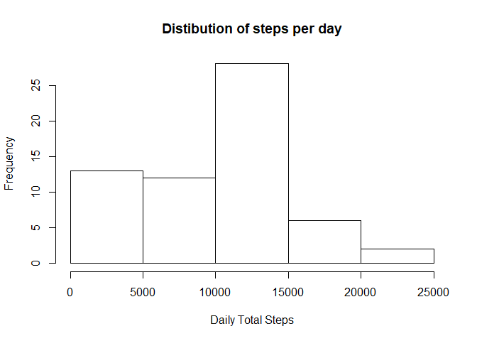
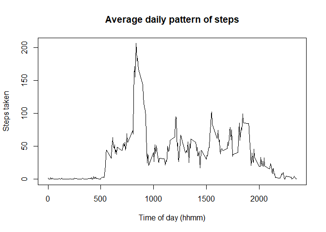
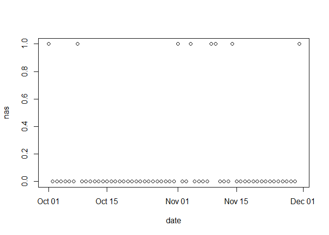
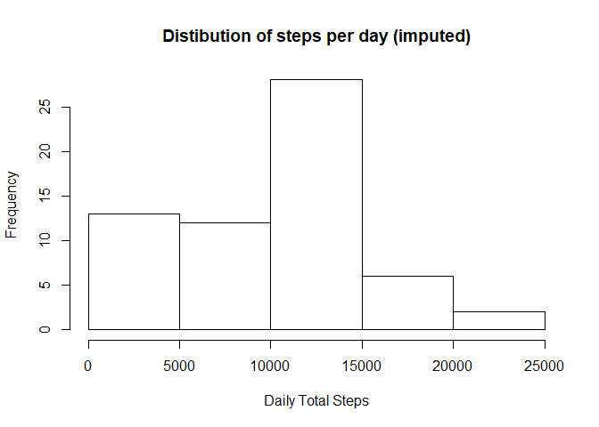
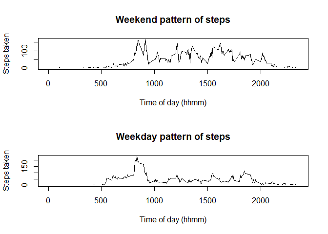

# Reproducible Research: Peer Assessment 1


## Loading and preprocessing the data

```r
library(dplyr)
library(magrittr)
A <- read.csv("~/Datasets/Coursera5.1/activity.csv")
A$date <- as.Date(A$date)
```


## What is mean total number of steps taken per day?

```r
A.sums <- summarize(group_by(A,date), steps = sum(steps,na.rm = T))
hist(A.sums$steps, main = "Distibution of steps per day", xlab = "Daily Total Steps", ylab = "Frequency")
```

<!-- -->

```r
ootpoot <- paste("The mean is", round(mean(A.sums$steps)),"and the median is", median(A.sums$steps))
```
Here is a histogram showing the distribtion. The mean is 9354 and the median is 10395 steps per day.


## What is the average daily activity pattern?

```r
A.int <- summarize(group_by(A,interval), steps = mean(steps,na.rm = T))
attach(A.int)
plot(interval, steps, type = "l"
     , main = "Average daily pattern of steps"
     , xlab = "Time of day (hhmm)"
     , ylab = "Steps taken"
     )
```

<!-- -->

```r
v <- steps== max(steps) #vector IDing max
ootpoot <- paste( "The busiest interval on average is", subset(A.int,v)[[1]]
  ,"with", round(subset(A.int, v))[[2]], "steps."
  )
detach()
```

The busiest interval on average is 835 with 206 steps.


## Imputing missing values
Let's get a look at the problem.

```r
miss.step <- summarise(group_by(A,date), nas = mean(is.na(steps)))
plot(miss.step)
```

<!-- -->

Looks like we're missing all data for just a few days.


```r
ct.Missing = length(filter(miss.step,nas == 1)[[1]])
```

Ok, so 8 days.


```r
ISteps <- summarize(group_by(A,interval), meanSteps = mean(steps, na.rm = T))
A2 <- inner_join(A,ISteps) %>% 
  mutate(steps2 = ifelse(is.na(steps),meanSteps,steps))
```

```
## Joining, by = "interval"
```

This message confirms we joined on Interval. Now we check the effect on our data.


```r
A2.sums <- summarize(group_by(A2,date), steps = sum(steps,na.rm = T))
hist(A2.sums$steps, main = "Distibution of steps per day (imputed)", xlab = "Daily Total Steps", ylab = "Frequency")
```

<!-- -->

```r
ootpoot2 <- paste("the mean is", round(mean(A2.sums$steps)),"and the median is", median(A2.sums$steps))
```

We find that the mean is 9354 and the median is 10395 which is very close to what we had before.


## Are there differences in activity patterns between weekdays and weekends?

First, let's create our factors and toss in a average and standard deviation of the total daily steps.

```r
A2 <- mutate(A2
          , wkday = as.factor(weekdays(date))
          , dd = as.factor(ifelse(wkday %in% c("Saturday","Sunday"), "Weekend","Weekday"))
)
A2.int <- summarize(
            group_by(A2,interval,dd),
            steps2 = mean (steps2)
          )
```

Now let's make the plot requested.

```r
par(mfrow =c(2,1))

with(subset(A2.int,dd=="Weekend")
    ,plot(interval, steps2, type = "l"
          , main = "Weekend pattern of steps"
          , xlab = "Time of day (hhmm)"
          , ylab = "Steps taken"
          ))

with(subset(A2.int,dd=="Weekday")
    ,plot(interval, steps2, type = "l"
          , main = "Weekday pattern of steps"
          , xlab = "Time of day (hhmm)"
          , ylab = "Steps taken"
          ))
```

<!-- -->

We can see our participant walks around a lot more on the weekend, but not as much early in the morning. That's consistent with rushing to work on weekdays and taking leisurely strolls on weekends.

*Note: it seems that knit2html() doesn't work with this newer version of markdown (included in Rstudio) so the images are in the folder "PA1_template_files" instead. I hope this is acceptable.*
